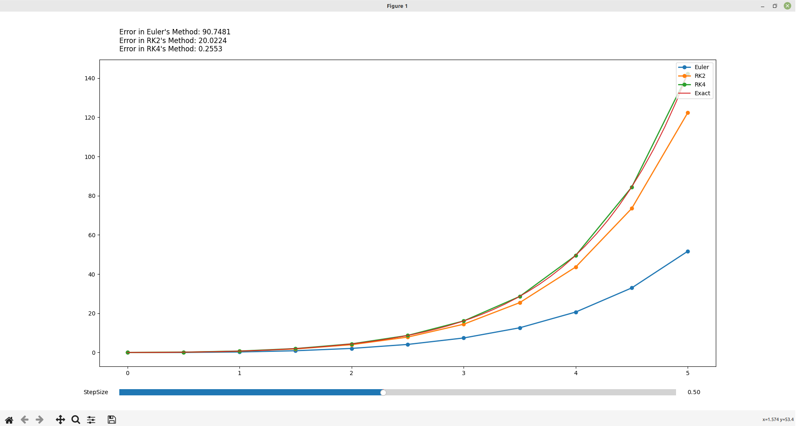

# Differential Grapher

Differential Equation grapher is a program written in python which solves a first order differential equation using 3 different methods and plots each solution on a same graph.
It compares following three methods:
1. Euler's Method
2. RK2 Method
3. RK4 Method

To be precise, it solves differential equation of the form:

- 

## :camera: Screenshot



## Installation

Use the package manager [pip](https://pip.pypa.io/en/stable/) to install the dependencies.

```bash
pip install -r requirements
```

## Usage

```bash
python main.py
```

## Contributing

Pull requests are welcome. For major changes, please open an issue first
to discuss what you would like to change.


## License

[MIT](https://choosealicense.com/licenses/mit/)
